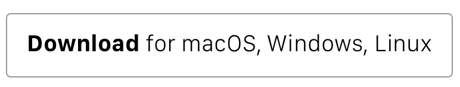

  Simple Subtitles Reader written in <a href="https://github.com/lukehoban/es6features">ES6</a> using <a href="https://github.com/facebook/react">React</a> & <a href="https://github.com/mobxjs/mobx">Mobx</a> and packaged with <a href="https://github.com/electron/electron">Electron</a>

